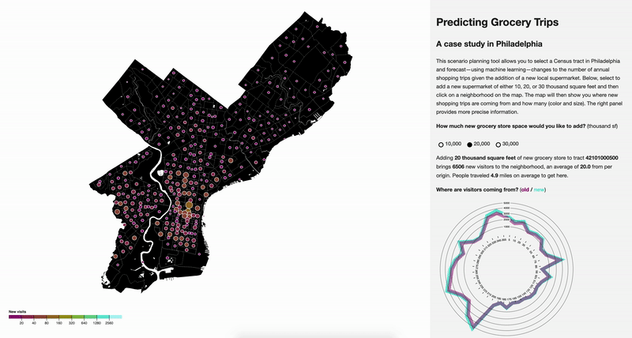
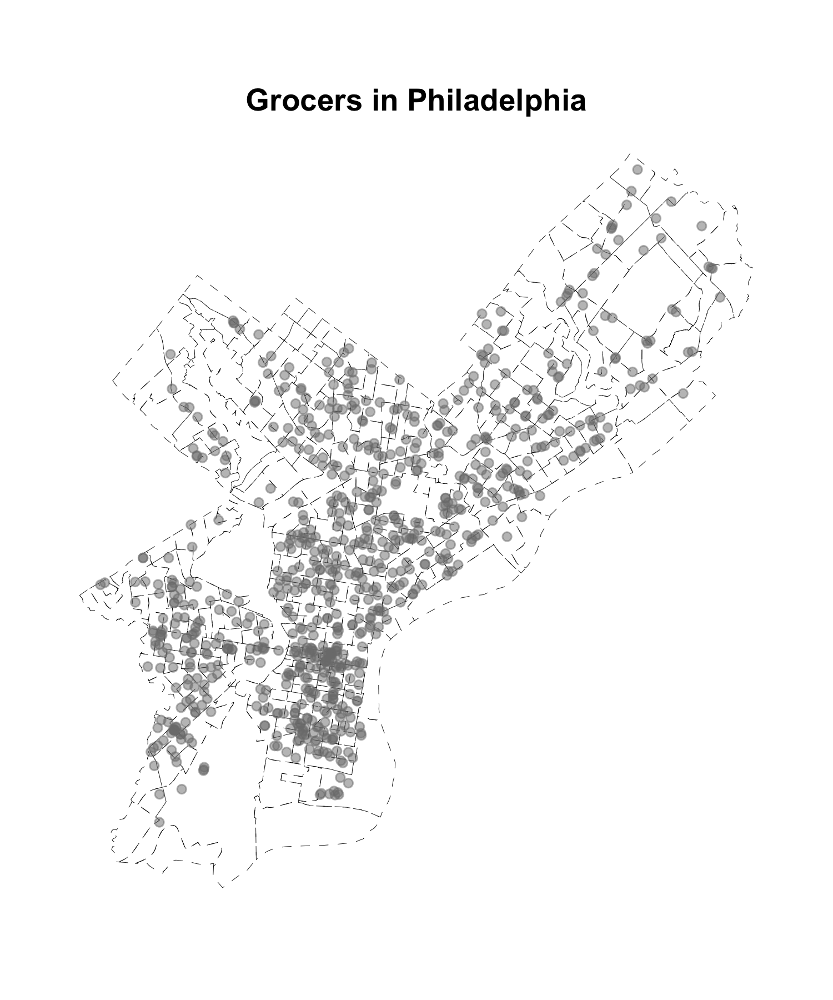
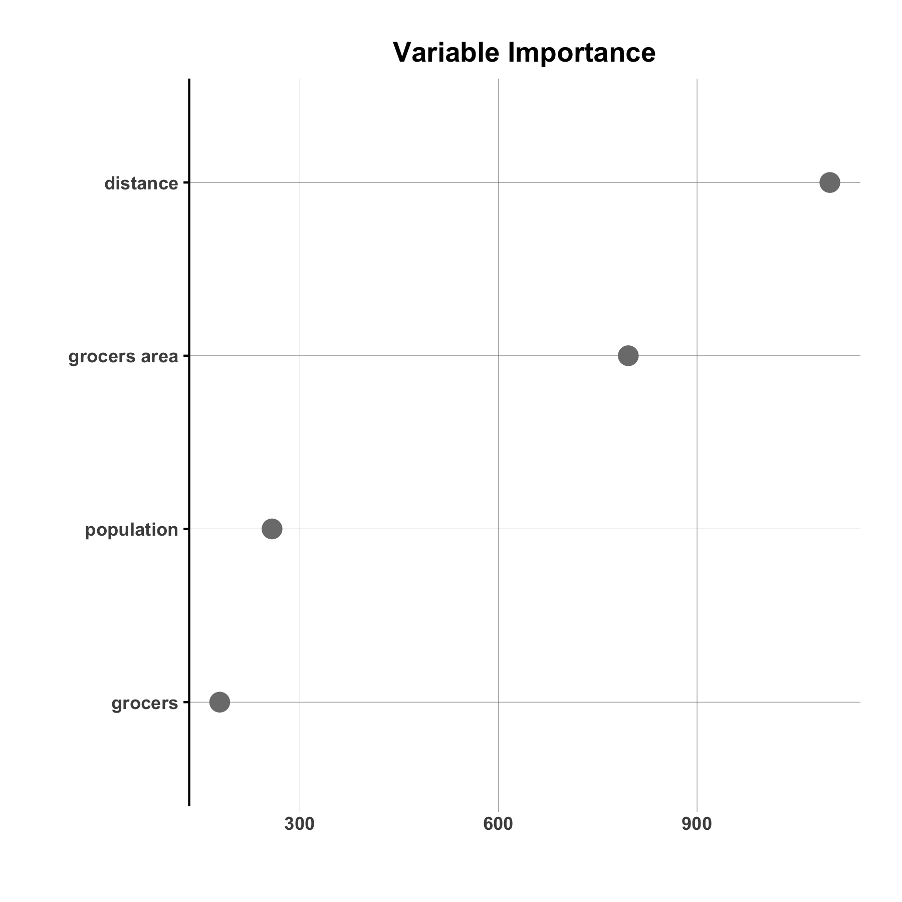
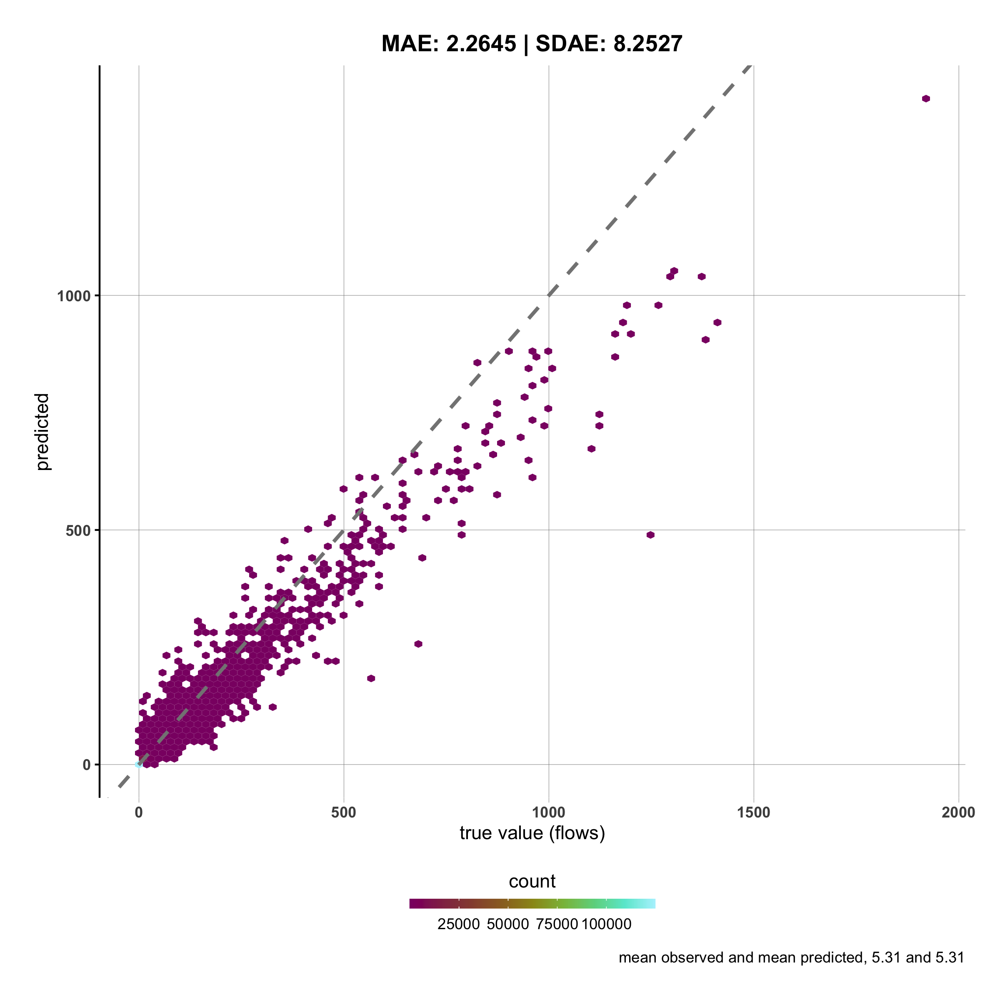
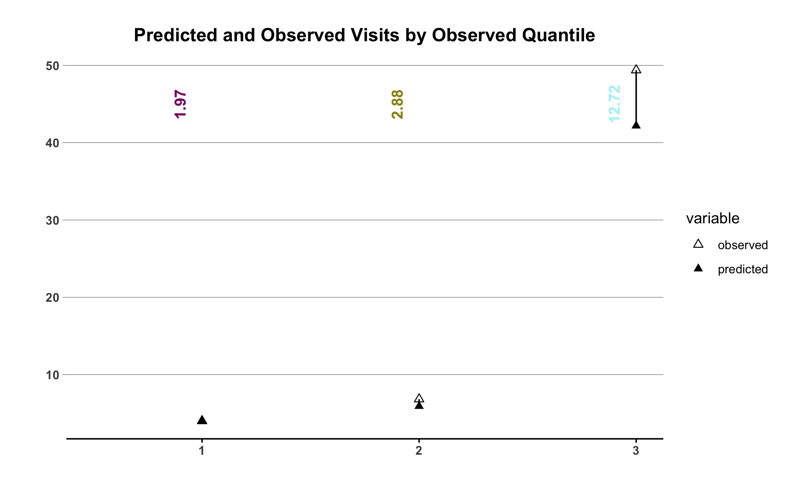
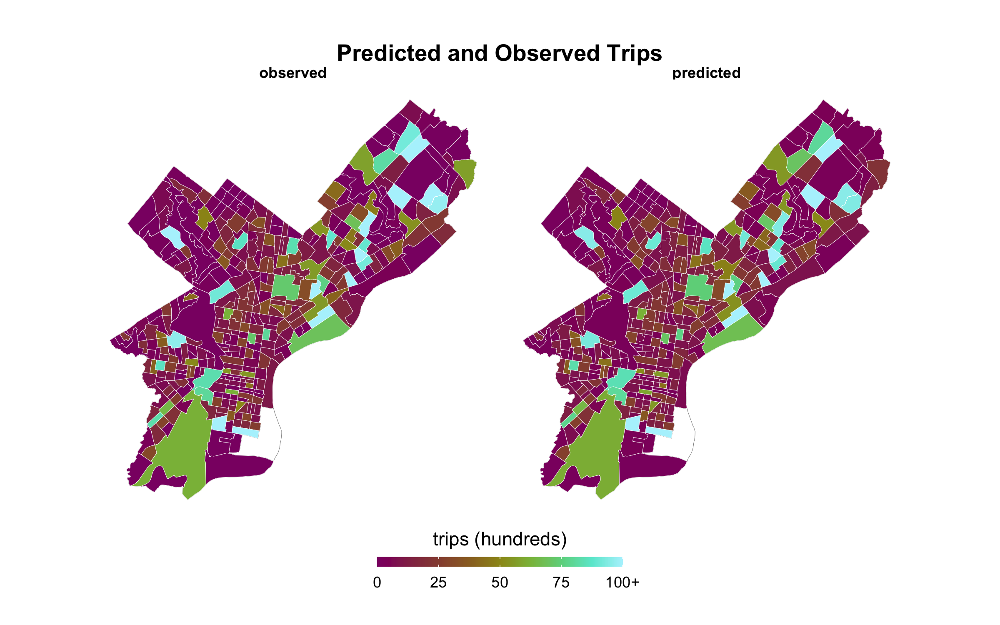
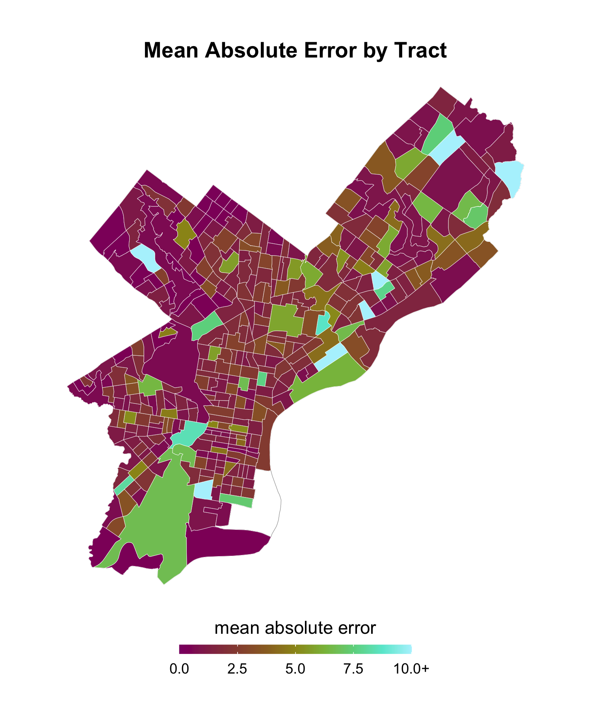
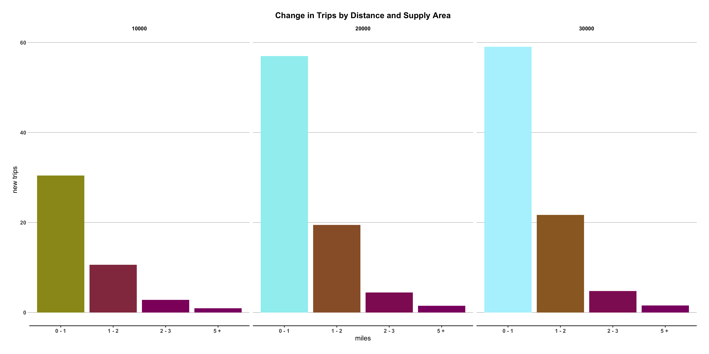

# PREDICTING GROCERY TRIPS
### using gravity models to understand foot traffic

**[@AndrewRenninger](https://twitter.com/AndrewRenninger)** & **[@KenSteif](https://twitter.com/KenSteif)**

Here we use a random forest to predict the amount of foot traffic to different parts of Philadelphia. This model is meant to show the relationship between distance, supply and grocery trips. What happens to travel between areas of Philadelphia as the total supply of grocers—both as the number of shops and total square footage across shops—changes, given the distance between those areas? With the model trained on past trends, we then simulate the addition of new supply to the grocery market, adding 10, 20, or 30 thousand square feet to each Census block group to see how mobility changes with the addition of a new store. The results can be found in an interactive application [here](https://asrenninger.github.io/gravity/).  

### motivtaion

Our goal is to create a scenario planning tool that models how mobility responds to the supply of grocery stores in the city. The results give insights into which neighborhoods would see the largest gains from a new store and could allow planners to limit food deserts while giving residents more convenient options for groceries. As distance decreases or as supply increases, traffic between pairs of neighborhoods increases; this tool allows you to test different locations for a new grocery store to see how travel patterns change. The strongest responses to new grocers occur in areas with limited existing grocery supply, and dimishing returns mean that areas that are already saturated with options see few new trips. Where is there pent up demand? What are the existing flows and how could we reduce travel? The application provides are tool to explore these results and these questions.       

### methodology

Behind this application is a set of predictions with a gravity model, in which travel between any pair of regions—in this case Census tracts—is a function of distance and mass. In our model, we use the floor area and count of grocers as our measure of destination mass and population according to the Census as our origin mass. We calculate Euclidean distance as our distance variable. We construct an origin-destination matrix based on trips to grocers; there are 384 tracts in Philadelphia for a total of 147,072 possible connections. Many of these connections see no traffic between them and indeed many tracts do not have any grocery stores within them, but we include them in the model as flows of zero.  

We run a random forest regression on the data, predicting the traffic along each flow given these parameters. We partition the data into 50/50 training and testing sets, balanced to have the same fraction of null flows. We then separate the training data in 10 folds and tune the hyperparameters to reduce root mean squared error (RMSE) across folds. With a tuned model, we log the variable importance according to its permuted value, a strategy that looks at how much the error in the model changes if we shuffle the feature in question, so that there is no longer a relationship between that feature and the response variable. The logic is simple: if you scramble the observations and the predictive accurary does not fall, it must not have been very important. 

This model performs well given limited feature engineering, with a r-squared value of 0.6. Mean prediction and mean observation are identical and the model only begins to fail at extreme values. 

We can see this more closely when we plot the error by quantile, breaking the flows into high, medium and low groups. The model sees little or no prediction error in the low and medium groups but underestimates flows in the high group. 

Finally, we can map predictions against observations. 

These tell us little about the size of the error, so we can plot that below to see that—as above—the largest errors occur at extremes. Tracts that saw outsize number of visitors are proving most difficult for the model.

We want to know if the model behaves sensibly given our use case—predicting changes to flows between origins and grocery destinations given a change in the size of the destination grocery store. We ran a script that added either 10, 20 or 30 thousand square feet of floor space and 1 new grocer to each tract, one by one, and predicted trips to that tract. When you use the application above, you are getting the difference between the model's original prediction and its new prediction after the supply shock. (Prediction against prediction, compared to prediction against observed, makes the change consistent and indicative.) Below we show that the addition of a grocery store, by and large, boosts trips from nearby and there are diminishing returns: large additions are less effective, per square foot, than small ones. This shows us that the model is working as expected. This model is meant to show the relationship between supply and shopping trips, moderated by distance; holding out extremes, it gives insights into how travel will change with new supply.  

We set out to forecast trips to create a scenario planning tool to help planners locate grocery supply in Philadelphia. If you are interested in the impacts of new grocery stores on neighborhood access, we urge you to check out the [interactive application](https://asrenninger.github.io/gravity/).  