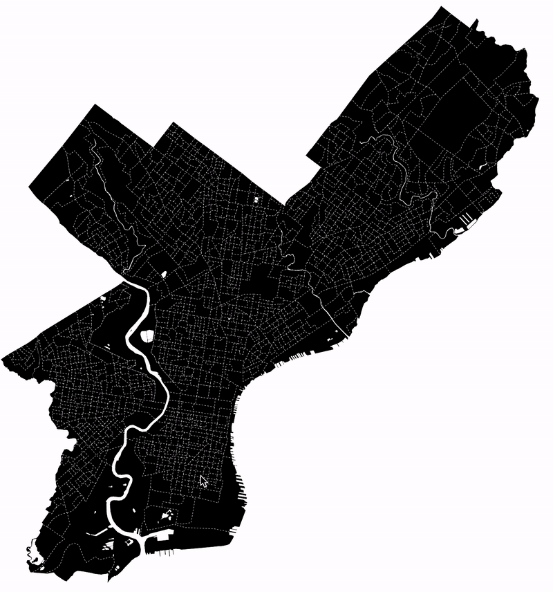
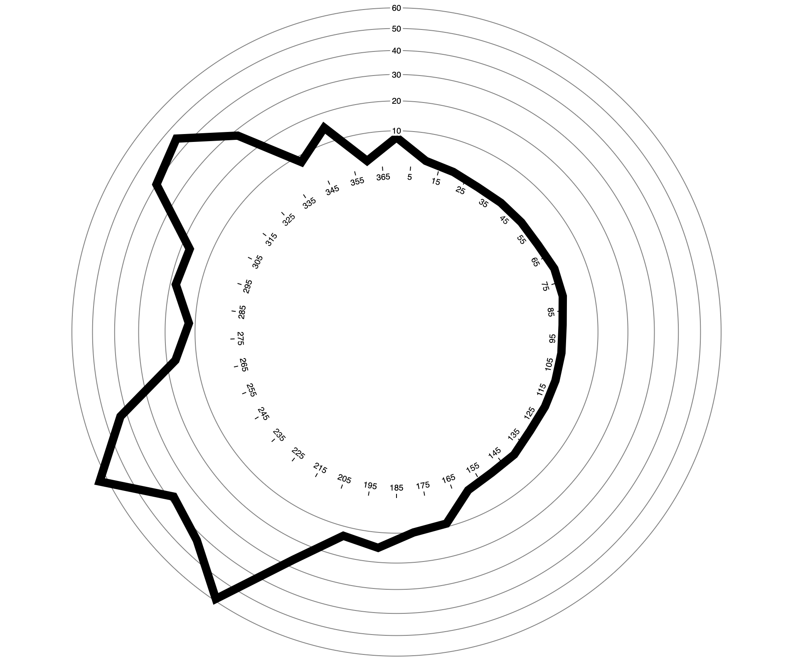
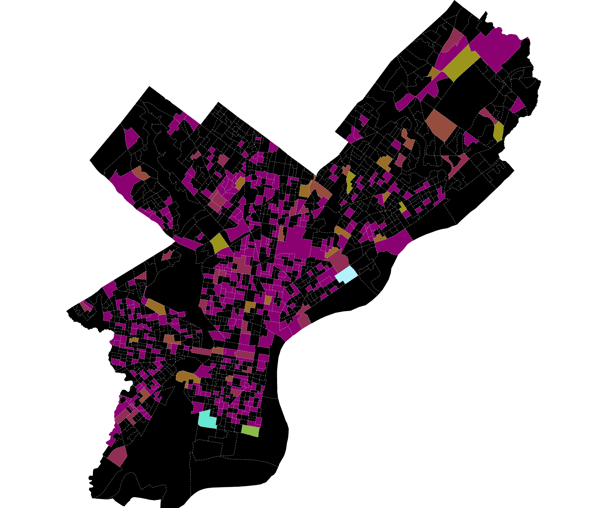

# gravity
### using gravity models to understand foot traffic

Here we use a random forest to approximate a gravity model and predict the amount of foot traffic to different parts of Philadelphia. With the model trained on past trends, we then simulate the addition of new supply to the grocery market, adding 10, 20, or 30 thousand square feet to each Census block group to see how mobility changes with the addition of a new store. The results can be found in an interactive [here](https://asrenninger.github.io/gravity/).  

